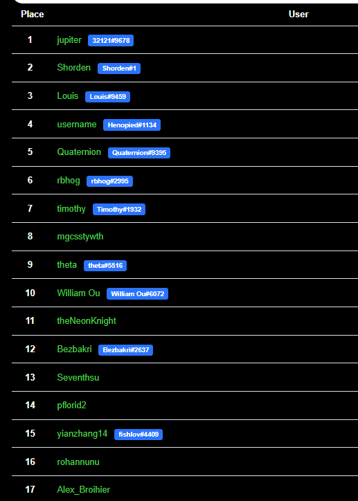

# CTFD-Discord-Integration

A Discord OAUTH Plugin to associate CTFd users with discord accounts. This replaces the OAUTH id field with the discord ID of the user. Currently, the scoreboard, and all user pages are modified from the `core-beta` theme to include our custom values.

### Setup

+ Clone project and place in `CTFd/CTFd/plugins` and restart CTFd 
+ Update `config.json` with your discord token values.
+ Add `http://<URL>/discord/oauth_callback` to discord OAUTH routes

### Screenshots

##### API Access

`/api/v1/discord/<discord_id>` will return the CTFd user with that ID.

#### Leaderboard

##### Badge

##### Login Button
