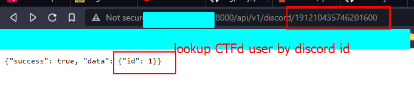

# CTFD-Discord-Integration

A Discord OAUTH Plugin to associate CTFd users with discord accounts. Note this does not replace login.
### Setup

+ Clone project and place in `CTFd/CTFd/plugins` and restart CTFd 
+ Update `config.json` with your discord token values.
+ Add `http://<URL>/discord/oauth_callback` to discord OAUTH routes

### Screenshots

##### API Access

##### Badge

##### Login Button
